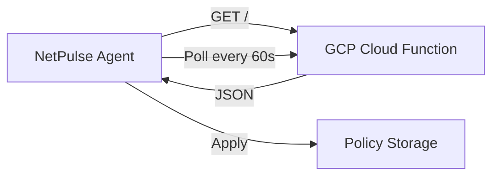

# Walkthrough - UI Polish & Cloud Sync 🚀

## Phase 2.6: Dual-Window Standalone Architecture 🏛️

### Objective
Move away from a single-window toggle to a robust, tray-driven dual-window architecture where the Dashboard and Technical Monitor exist as independent, singleton entities.

### Key Implementation Details

#### 1. Singleton Windows via `Window` Scene
- **Refactor**: Replaced `WindowGroup` with `Window("Title", id: "...")` for both `main` and `technical` scenes.
- **Benefit**: Ensures only **one instance** of the Dashboard and **one instance** of the Technical Monitor can be open at a time, preventing window clutter.

#### 2. Differentiated Window Behavior
| Feature | Dashboard (Simple View) | Technical Monitor |
|:---|:---|:---|
| **Primary Goal** | Minimalist Widget | Detailed Analysis |
| **Size** | **Fixed (400x500)** | **Resizable** |
| **Controls** | **X (Close) Only** | Full (X, -, +) |
| **Always on Top** | Yes | Yes |

#### 3. Enhanced Tray Menu
- Explicitly separated actions for clarity:
  - `Show Dashboard` (Shortcut: `D`)
  - `Open Technical Monitor` (Shortcut: `T`)
- **Persistence Logic**: Added `ensureWindowFront` helper to re-apply window styling (hidden buttons/fixed size) every time the window is requested from the tray, fixing macOS resets.

---

## Phase 4: Cloud Sync & Policy Management ☁️

### Architecture

### Implementation
- **Backend**: Gen 2 Cloud Function in `asia-southeast2`.
- **Sync**: 60-second polling for near real-time whitelist and enforcement updates.
- **Verification**: Successfully tested remote "Focus Mode" activation and whitelisting.

---

## Phase 2.5: Simple User View (Dashboard) 🎨

### Features
- **[`CloudPulseIndicator.swift`](../Sources/NetPulse/UI/CloudPulseIndicator.swift)**: Animated "breathing" status light (🟢🟡🔴🔵🟣).
- **Realtime Speed**: Displays current download/upload speeds instead of cumulative totals.
- **Minimalist UX**: Large status badge and a prominent Meeting Mode toggle.

---

## Final Verification Results

✅ **Singleton Enforcement**: Verified that clicking tray menu multiple times only activates the existing window.
✅ **Fixed vs Resizable**: Dashboard stays locked (400x500), Technical Monitor is fully resizable for IT support.
✅ **X-Only Styling**: Verified close-only buttons for the Dashboard across all states.
✅ **Cloud Sync**: 60s polling verified with realtime policy updates.

### Success Metrics
- [x] Singleton windows (No multi-instance clutter)
- [x] Differentiated window controls (Widget vs Tool)
- [x] Persistent styling (Buttons don't reappear on tray show)
- [x] Semi-realtime cloud sync
